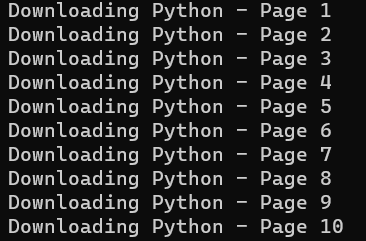
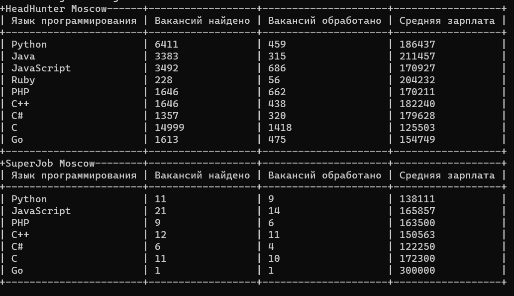

# Programming vacancies compare

This script collects and analyzes job vacancy statistics for various programming languages in Moscow using the HeadHunter and SuperJob APIs.

Fetches job vacancy data from HeadHunter and SuperJob for programming languages such as Python, Java, JavaScript, Ruby, PHP, C++, C#, C, and Go.

Calculates average salaries for the collected job vacancies.

Displays statistics in a tabular format for easy analysis.

## How to install

Python3 should already be installed. Then use pip (or pip3, if there is a conflict with Python2) to install dependencies:

```bash
pip install -r requirements.txt
```

Before you can run this script, you need to obtain API keys from SuperJob. The API key should be stored in environment variables for security.

You can obtain one by visiting the [SuperJob API website](https://api.superjob.ru/).

### Configuration

Create a .env file in the project's root directory.

Add the following environment variables:

```bash
SUPERJOB_API_KEY=YOUR_SUPERJOB_API_KEY
```
Replace YOUR_SUPERJOB_API_KEY with your SuperJob API Key

## How to run Script

Run the script using the following command:

```bash
python salary_analysis.py
```
Then you see the code execution: 



And finally a result:



## Project Goals
The code is written for educational purposes on online-course for web-developers, dvmn.org.


